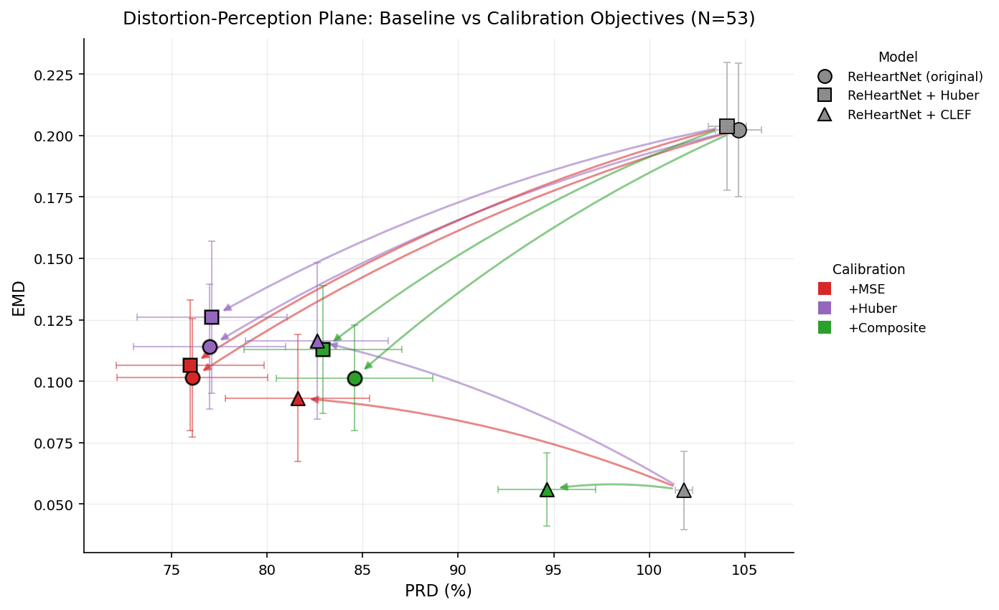

# A Change of Heart: Navigating the Perception-Distortion Trade-off in PPG-to-ECG Reconstruction

Reconstructs Lead II ECG from single-channel PPG using a **Densely-Connected Bidirectional LSTM (DC-BiLSTM)**, built on **Lee et al. (2026)**'s ReHeartNet, on the BIDMC dataset (53 subjects, 8-fold subject-disjoint CV).

**Headline finding:** per-subject calibration of a population-trained model recovers most of its cross-subject generalization gap, but trades off *distortion* (PRD, Pearson r) against *perception* (EMD/KS rhythm-distribution fidelity) — and that trade-off is asymmetric. For a model trained with a plain pointwise loss, every calibration objective improves both axes together. For a model trained with an added CLEF perceptual loss term (already near the perception-distortion frontier), a pointwise calibration objective actively destroys the perceptual gain, while a composite objective (matching the training loss) avoids it. This replicates Blau & Michaeli's perception-distortion framework and Li et al.'s three-stage (positive-sum / coopetitive / negative-sum) taxonomy — originally proposed for radar-based cardiac sensing (TriDP-PTM) — in a PPG-to-ECG setting.

This README covers only the three models behind that headline result (the "calib-3way" trio) and how to reproduce them; additional exploratory diagnostics (literature learning-rate instability, architecture ablation, phase-alignment checks, etc.) are not needed to reproduce the main result and are omitted here.

---

## The Three Models ("calib-3way" trio)

All three share the DC-BiLSTM architecture and Optuna-tuned hyperparameters (Table below) — only the training loss differs:

| Model | Loss | Windows | Checkpoint source |
|---|---|---|---|
| `reheartnet_original` | MSE | 4 s, no overlap, FIR bandpass | `scripts/compare_reheartnet.py --lr <optuna_lr>` |
| `reheartnet_huber` | Huber | 4 s, no overlap, FIR bandpass | `scripts/compare_reheartnet.py --lr <optuna_lr>` |
| `arch_reheartnet` | Huber + CLEF | 10 s, 50% overlap, no bandpass | `run_cv.py --all-models` (DC-BiLSTM sub-run) |

All three are evaluated and calibrated on a common 10 s/50%-overlap/no-bandpass window (CLEF's native configuration) for direct comparability — see `scripts/diag_calib_loss_ablation.py`.

---

## Setup

```bash
conda env create -f environment.yml
conda activate reheartnet
python scripts/setup_clef.py        # clone + patch + install CLEF

# GPU: reinstall PyTorch with CUDA after activation
pip install torch torchvision --index-url https://download.pytorch.org/whl/cu121   # cu118/cu124 for other CUDA versions

mkdir -p models/clef
curl -L "https://zenodo.org/records/17572734/files/clef_medium.ckpt?download=1" -o models/clef/clef_medium.ckpt
```

**Requires:** BIDMC dataset in `data/BIDMC/` (53 `.dat`/`.hea` pairs from PhysioNet). CLEF size is auto-selected (`medium` on GPU, `small` on CPU); override with `--clef-size`.

---

## Reproducing the Three Models

**1. Hyperparameter search** (Optuna; tunes `lr`, `lambda_clinical`, `huber_delta`, `hidden_size`):

```bash
python scripts/tune_hyperparams.py --full
```
→ `results/best_hyperparams.json`. Our run completed 25/50 allocated trials (~13 h, GPU-shared) before freezing on:

| Hyperparameter | Best value |
|---|---|
| Learning rate `lr` | 3.15 × 10⁻⁴ |
| CLEF loss weight `lambda_clinical` | 0.964 |
| Huber delta `huber_delta` | 1.714 |
| Hidden size `H` | 32 |

This configuration (lr, λ, δ, H=32 pinned uniformly across all variants) is used for every experiment below.

**2. `reheartnet_original` + `reheartnet_huber` at the Optuna learning rate:**

```bash
python scripts/compare_reheartnet.py --only reheartnet_original,reheartnet_huber \
    --lr 3.15e-4 --output-dir results/comparison_reheartnet_optunalr --no-wandb
```

`--lr` overrides only the learning rate (top priority over the model's pinned/literature value); `huber_delta` still resolves from Optuna for `reheartnet_huber`. (Without `--lr`, this script instead reproduces Lee et al.'s literature protocol, lr=10⁻²; that variant suffers severe training instability and is not the configuration this project's headline result is built on.)

**3. `arch_reheartnet` (the CLEF variant):**

```bash
python run_cv.py --all-models --no-wandb
```

This launches a 4-architecture ablation (Linear/LSTM/BiLSTM/DC-BiLSTM, all Huber+CLEF loss, Optuna hyperparameters); only the DC-BiLSTM run (`arch_reheartnet`) is used going forward — the other three were descoped early once they showed the same generalization gap (see Appendix). Checkpoints land in the shared `checkpoints/` directory as `reheartnet_fold_XX_best.pt`.

---

## Per-Subject Calibration & Headline Diagnostics

On top of each population-trained checkpoint, we simulate a brief per-subject calibration session: each test subject's windows are split chronologically into a calibration slice (first 20%, ≈100 s) and an eval slice (remaining 80%, never used for fine-tuning); a copy of the checkpoint is fine-tuned on the calibration slice (20 epochs, Adam, lr=10⁻⁴) and re-evaluated on the eval slice.

```bash
# Full 3-model x 3-calibration-objective sweep (MSE / Huber / Composite), full N=53 cohort:
for L in mse huber composite; do
  python scripts/diag_calib_loss_ablation.py \
    --results-dir results/comparison_reheartnet_optunalr \
    --models reheartnet_original,reheartnet_huber,arch_reheartnet \
    --calib-loss $L \
    --diagnostic-classifier checkpoints/ptbxl_diagnostic_classifier.pt \
    --output-dir results/diag_calib_3way_${L}_n53
done
```

A **composite** calibration objective (`Huber(δ=1.714) + λ·CLEF`, the same objective `arch_reheartnet` was trained with) is also supported via `--calib-loss composite`, alongside plain `mse`/`huber`.

**Diagnostic consistency**: a `CLEFProbeClassifier` (frozen, MIMIC-IV-pretrained CLEF encoder + a linear probe trained on PTB-XL's 5 diagnostic superclasses — `scripts/train_diagnostic_classifier.py`) checks whether a reconstruction would receive the same diagnosis as the real ECG, via KL divergence and top-1 flip rate between real/reconstructed class-probability vectors.



*The headline result: PRD (distortion) vs. EMD (perception), one point per model × calibration condition, with arrows from baseline to each calibrated variant. The two distortion-trained models move down-and-left under every calibration objective (positive-sum); the CLEF-trained model's pointwise-calibration arrows move up-and-right, ending **worse** than baseline (negative-sum), while its composite arrow stays nearly flat (coopetitive). Generated by `scripts/plot_distortion_perception_plane.py`.*

See also `scripts/plot_diag_class_heatmap.py` (per-class diagnostic error, model × calibration) and `scripts/diag_plot_calibration_multi_model.py` (qualitative waveform comparison across all three models for one subject).

---

## Evaluation Metrics

| Metric | Description | Direction |
|--------|-------------|-----------|
| **RMSE / PRD** | (Normalized) reconstruction error | ↓ lower |
| **Pearson r** | Waveform correlation | ↑ higher |
| **EMD** | Wasserstein-1 distance on RR-interval distributions | ↓ lower |
| **KS stat** | KS test D-statistic on RR-interval CDFs | ↓ lower |
| **Beat MAE** | Mean absolute R-peak timing error (s) | ↓ lower |
| **diag_kl / flip_rate** | `CLEFProbeClassifier` diagnostic-consistency (KL divergence / top-1 disagreement, real vs. reconstructed) | ↓ lower |

R-peaks detected via `neurokit2.ecg_peaks()` (Pan–Tompkins); windows with <3 peaks are excluded. All metrics reported as mean ± 95% CI.

---

## Project Structure

```
Final_Project/
├── core/
│   ├── config.py                   # Hyperparameters and paths
│   ├── data_loader.py              # BIDMCDataset, build_group_fold, get_cv_splits
│   ├── train.py                    # train_fold() — loss_type: mse/huber/clef
│   ├── evaluate.py                 # evaluate_fold() — clinical metrics
│   ├── losses/composite_loss.py    # ClinicalCompositeLoss + load_clef_encoder()
│   ├── models/
│   │   ├── reheartnet.py           # DC-BiLSTM (5 blocks, dense connections)
│   │   ├── baselines.py            # LinearReg, SimpleLSTM, PlainBiLSTM
│   │   └── ptbxl_classifier.py     # CLEFProbeClassifier (diagnostic classifier)
│   └── visualization/plots.py      # Figure generation
├── src/preprocessing.py            # WFDB loading, z-score, FIR bandpass, windowing
├── scripts/
│   ├── tune_hyperparams.py         # Optuna search
│   ├── compare_reheartnet.py       # original/Huber/CLEF loss comparison
│   ├── diag_calib_loss_ablation.py # Per-subject calibration sweep (main diagnostic)
│   ├── plot_distortion_perception_plane.py
│   ├── plot_diag_class_heatmap.py
│   ├── print_diag_class_table.py / print_diag_spearman_table.py
│   └── diag_plot_calibration_multi_model.py / diag_plot_calibration_multi_loss.py
├── run_cv.py                       # Main CV entry point (single model or --all-models)
├── data/BIDMC/                     # 53 subjects (not committed)
└── models/clef/                    # CLEF checkpoint (not committed)
```

---

## Training Loss

```
Original (Lee et al.):  L = MSELoss(pred, true)
Ours:                    L = HuberLoss(pred, true, δ) + λ · ||Φ(true) − Φ(pred)||²
```
where `Φ` is the frozen CLEF encoder's feature map. `δ` and `λ` are Optuna-tuned (table above).

---

## Data

**BIDMC** (PhysioNet) — 53 ICU subjects, simultaneous ECG + PPG at 125 Hz, ~8 min each. Preprocessing (`src/preprocessing.py`): channel-name-based loading → z-score normalization → optional FIR bandpass → fixed-length windowing → train-only PPG→ECG phase alignment via cross-correlation.

---

## References

- **ReHeartNet**: Lee et al. (2026), IEEE Open Journal of Engineering in Medicine and Biology, [doi:10.1109/OJEMB.2026.3670010](https://doi.org/10.1109/OJEMB.2026.3670010)
- **CLEF**: Nokia Bell Labs — [GitHub](https://github.com/Nokia-Bell-Labs/ecg-foundation-model) · [Zenodo weights](https://zenodo.org/records/17572734) · arXiv:2512.02180
- **Perception-Distortion Tradeoff**: Blau & Michaeli (2018), CVPR, arXiv:1711.06077
- **TriDP-PTM**: Li et al. (2026), three-stage distortion-perception taxonomy for radar cardiac sensing, arXiv:2605.25725
- **BIDMC dataset**: Pimentel et al. (2016), PhysioNet, [doi:10.13026/C2208R](https://doi.org/10.13026/C2208R)
- **Optuna**: Akiba et al. (2019), KDD, [doi:10.1145/3292500.3330701](https://doi.org/10.1145/3292500.3330701)
- **NeuroKit2**: Makowski et al. (2021), *Behavior Research Methods*
